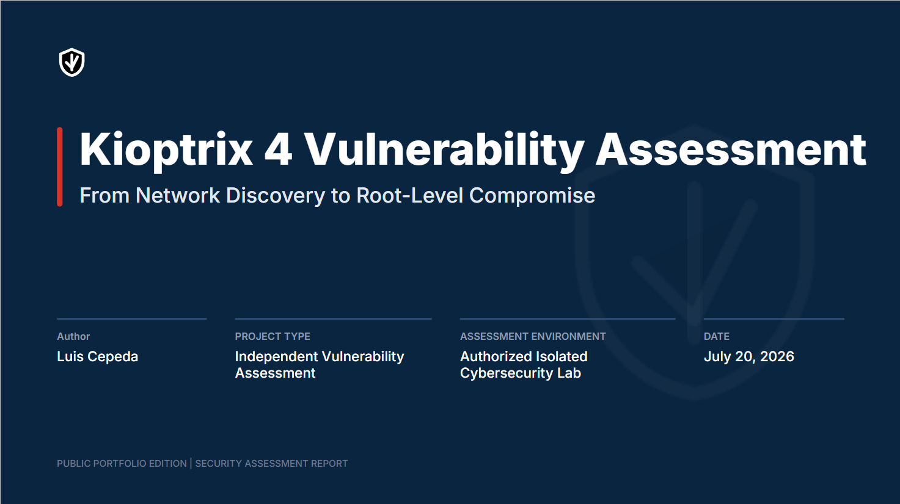
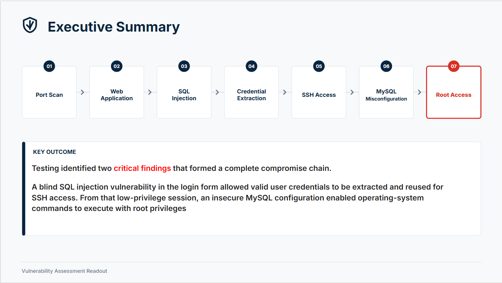
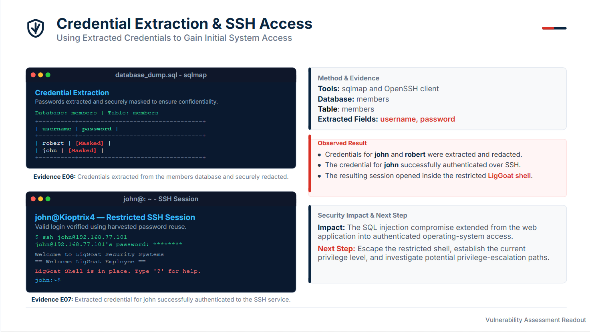
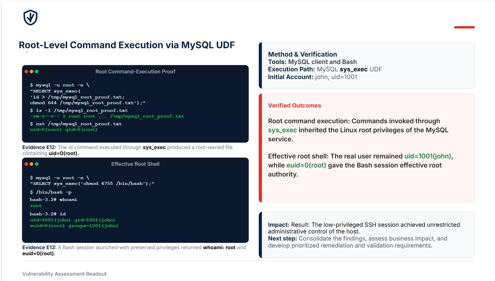
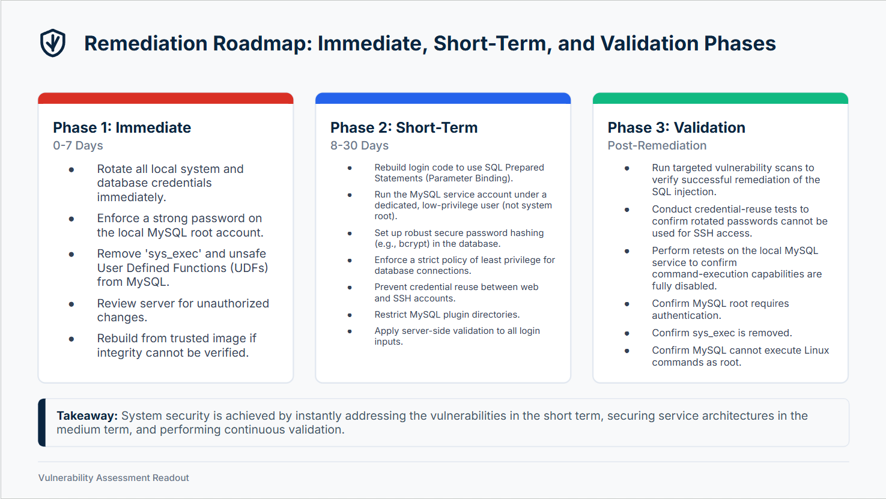

# Kioptrix 4 Vulnerability Assessment

**Authorized isolated-lab assessment demonstrating a verified attack path from network discovery to effective Linux root access.**

  

<h2 align="center">
  <a href="presentation/Kioptrix4-Public-Assessment.pdf">
    View the Full Assessment Presentation
  </a>
</h2>

  The presentation is the primary project deliverable, documenting the complete
  assessment from initial discovery through effective Linux root access.

  
  
  

---

## Presentation Preview

  
  

  
  

  <em>Selected slides from the full assessment presentation.</em>

---

## Executive Summary

This portfolio project documents an authorized vulnerability assessment of **Kioptrix Level 4** conducted inside an isolated VirtualBox laboratory.

Testing identified two critical findings that formed a complete compromise chain:

1. A blind SQL injection vulnerability in the login application exposed valid credentials, which were reused to obtain authenticated SSH access.
2. An insecure MySQL configuration allowed the low-privileged SSH session to execute Linux commands with root privileges and obtain an effective root shell.

The project demonstrates not only exploitation, but also evidence validation, negative controls, source-code root-cause analysis, business-risk communication, remediation planning, and post-remediation validation design.

---

## Assessment at a Glance

  
  
  
  

  <strong>
    Discovery → Service Enumeration → SQL Injection → Credential Access →
    Authenticated SSH → Shell Escape → MySQL Escalation → Effective Root
  </strong>

| Assessment Phase | Evidence | Verified Outcome | Capabilities Demonstrated |
|---|---|---|---|
| **Reconnaissance & Enumeration** | **E01–E02** | Identified exposed SSH, HTTP, NetBIOS, and SMB services and validated the Apache, PHP, OpenSSH, and Samba technology stack. | Network discovery, full TCP scanning, targeted enumeration, WhatWeb, and Nikto analysis |
| **Web Testing & SQL Injection** | **E03–E05** | Mapped the login request, established an invalid-login control, and confirmed boolean-based and time-based blind SQL injection in `mypassword`. | HTTP analysis, `curl`, manual testing, sqlmap validation, and positive and negative controls |
| **Credential & Host Access** | **E06–E07** | Extracted valid credentials from the `members` database and authenticated to SSH as `john`. | Database enumeration, credential analysis, credential-reuse testing, and SSH validation |
| **Post-Exploitation & Root Cause** | **E08–E10** | Escaped the restricted shell, confirmed the low-privilege baseline, and identified unsafe SQL construction and excessive database privileges. | Linux enumeration, restricted-shell analysis, Python shell escape, privilege baselining, and source-code review |
| **Privilege Escalation & Verification** | **E11–E13** | Confirmed passwordless MySQL administrative access, a root-owned MySQL service, an enabled `sys_exec` UDF, root-level command execution, and `euid=0(root)`. | MySQL security review, privilege-escalation analysis, UDF command execution, and root-access verification |

> **Verification path:** Review the [Assessment Presentation](presentation/Kioptrix4-Public-Assessment.pdf), verify its technical claims through the [Evidence Directory](evidence/EVIDENCE_INDEX.md), and inspect the complete analysis in the [Detailed Findings](findings/).

---

## Primary Findings

| ID | Finding | Severity | Demonstrated Outcome |
|---|---|---:|---|
| [K4-001](findings/K4-001-sql-injection.md) | SQL Injection in Login Authentication | Critical | Credential extraction and authenticated SSH access |
| [K4-002](findings/K4-002-mysql-root-command-execution.md) | MySQL Misconfiguration Enabling Root-Level Command Execution | Critical | Root-level command execution and a shell with `euid=0(root)` |

---

## Supporting Project Resources

| Resource | Purpose |
|---|---|
| [Evidence Directory](evidence/EVIDENCE_INDEX.md) | Maps presentation claims E01–E13 to testing objectives, commands, sanitized screenshots, transcripts, results, limitations, and related findings |
| [Detailed Findings](findings/) | Contains the complete technical writeups for K4-001 and K4-002 |
| [Scope and Authorization](docs/SCOPE_AND_AUTHORIZATION.md) | Documents assessment ownership, boundaries, isolation, and safety controls |
| [Evidence Handling](docs/EVIDENCE_HANDLING.md) | Explains artifact preservation, sanitization, and public-release procedures |
| [Comparable Incidents](references/comparable-incidents.md) | Provides authoritative sources for the presentation’s documented business-impact comparisons |

---

## Evidence Handling

Original assessment artifacts are preserved privately.

The public repository contains sanitized copies with credentials, password values, and session identifiers redacted. Private RFC 1918 laboratory addresses are retained for technical traceability.

Presentation exhibits were reconstructed from the original terminal evidence for readability and visual consistency. They do not replace the screenshots and transcripts referenced in the [Evidence Directory](evidence/EVIDENCE_INDEX.md).

See [Evidence Handling](docs/EVIDENCE_HANDLING.md) for the complete policy.

---

## Scope and Authorization

All testing was performed against intentionally vulnerable systems owned and controlled by the assessor inside an isolated laboratory environment.

No testing was conducted against public, production, or third-party systems.

The techniques documented in this repository must not be used against systems without explicit authorization.

---

## Repository

**GitHub:** https://github.com/luicep/kioptrix4
