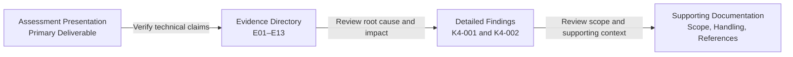

# Kioptrix 4 Vulnerability Assessment

**Authorized isolated-lab assessment demonstrating a verified attack path from network discovery to effective Linux root access.**

<p align="center">
  <a href="presentation/Kioptrix4-Public-Assessment.pdf">
    
  </a>
</p>

<h2 align="center">
  <a href="presentation/Kioptrix4-Public-Assessment.pdf">
    View the Full Assessment Presentation
  </a>
</h2>

<p align="center">
  The presentation is the primary project deliverable, documenting the complete
  assessment from initial discovery through effective Linux root access.
</p>

<p align="center">
  <a href="presentation/Kioptrix4-Public-Assessment.pdf">
    
  </a>
  <a href="evidence/EVIDENCE_INDEX.md">
    
  </a>
  <a href="findings/">
    
  </a>
</p>

---

## Presentation Preview

<p align="center">
  <a href="presentation/Kioptrix4-Public-Assessment.pdf">
    
  </a>
  <a href="presentation/Kioptrix4-Public-Assessment.pdf">
    
  </a>
</p>

<p align="center">
  <a href="presentation/Kioptrix4-Public-Assessment.pdf">
    
  </a>
  <a href="presentation/Kioptrix4-Public-Assessment.pdf">
    
  </a>
  <a href="presentation/Kioptrix4-Public-Assessment.pdf">
    
  </a>
</p>

<h3 align="center">
  <a href="presentation/Kioptrix4-Public-Assessment.pdf">
    Open the Full Assessment Presentation
  </a>
</h3>

<p align="center">
  The Evidence Directory provides technical verification for presentation claims E01–E13.
</p>

---

## Project at a Glance

```mermaid
flowchart LR
    A["Network Discovery"] --> B["Service Enumeration"]
    B --> C["Login Mapping"]
    C --> D["Blind SQL Injection"]
    D --> E["Credential Extraction"]
    E --> F["Authenticated SSH Access"]
    F --> G["Restricted-Shell Escape"]
    G --> H["MySQL Misconfiguration"]
    H --> I["Root-Level Execution"]
    I --> J["Effective Root Shell"]
```





---

## Executive Summary

This portfolio project documents an authorized vulnerability assessment of **Kioptrix Level 4** conducted inside an isolated VirtualBox laboratory.

Testing identified two critical findings that formed a complete compromise chain:

1. A blind SQL injection vulnerability in the login application exposed valid credentials, which were reused to obtain authenticated SSH access.
2. An insecure MySQL configuration allowed the low-privileged SSH session to execute Linux commands with root privileges and obtain an effective root shell.

The project demonstrates more than exploitation. It also includes evidence validation, negative controls, source-code root-cause analysis, business-risk communication, remediation planning, and post-remediation validation requirements.

---

## Verified Attack Path

```text
Network Discovery
        ↓
Service Enumeration
        ↓
Login Request Mapping
        ↓
Blind SQL Injection
        ↓
Credential Extraction
        ↓
Authenticated SSH Access
        ↓
Restricted-Shell Escape
        ↓
MySQL Misconfiguration
        ↓
Root-Level Command Execution
        ↓
Effective Root Shell
```

---

## Primary Findings

| ID | Finding | Severity | Demonstrated Outcome |
|---|---|---:|---|
| [K4-001](findings/K4-001-sql-injection.md) | SQL Injection in Login Authentication | Critical | Credential extraction and authenticated SSH access |
| [K4-002](findings/K4-002-mysql-root-command-execution.md) | MySQL Misconfiguration Enabling Root-Level Command Execution | Critical | Root-level command execution and a shell with `euid=0(root)` |

---

## Evidence and Verification

Every major presentation claim can be traced to supporting technical evidence:

```text
Presentation Claim
        ↓
Evidence ID
        ↓
GitHub Evidence Entry
        ↓
Sanitized Screenshot or Transcript
        ↓
Detailed Vulnerability Finding
```

### Evidence Ranges

| Evidence | Assessment Phase |
|---|---|
| **E01–E02** | Reconnaissance and service enumeration |
| **E03–E05** | Login mapping and SQL injection validation |
| **E06–E07** | Credential extraction and SSH access |
| **E08–E10** | Shell escape, privilege baseline, and root-cause analysis |
| **E11–E13** | MySQL escalation and root-access verification |

The [Evidence Directory](evidence/EVIDENCE_INDEX.md) is the primary technical-verification layer for this project.

---

## Skills Demonstrated

- Network discovery and full TCP service enumeration
- Web application and authentication-flow testing
- SQL injection validation using positive and negative controls
- Database enumeration and credential analysis
- Credential-reuse and SSH authentication testing
- Linux post-exploitation and privilege baselining
- Restricted-shell analysis and escape
- Application source-code root-cause analysis
- MySQL account, service, and UDF security review
- Root-level command-execution verification
- Evidence preservation, redaction, and traceability
- Vulnerability reporting and executive risk communication
- Remediation planning and validation design

---

## Supporting Project Resources

| Resource | Purpose |
|---|---|
| [Evidence Directory](evidence/EVIDENCE_INDEX.md) | Verifies presentation claims using evidence IDs E01–E13, sanitized screenshots, transcripts, results, limitations, and related findings |
| [Detailed Findings](findings/) | Contains the complete technical writeups for K4-001 and K4-002 |
| [Scope and Authorization](docs/SCOPE_AND_AUTHORIZATION.md) | Documents assessment ownership, boundaries, isolation, and safety controls |
| [Evidence Handling](docs/EVIDENCE_HANDLING.md) | Explains artifact preservation, sanitization, and public-release procedures |
| [Comparable Incidents](references/comparable-incidents.md) | Provides authoritative sources for the presentation’s documented business-impact comparisons |

---

## Evidence Handling

Original assessment artifacts are preserved privately.

The public repository contains sanitized copies with credentials, password values, and session identifiers redacted. Private RFC 1918 laboratory addresses are retained for technical traceability.

Presentation exhibits were reconstructed from the original terminal evidence for readability and visual consistency. They do not replace the underlying screenshots and transcripts referenced in the [Evidence Directory](evidence/EVIDENCE_INDEX.md).

See [Evidence Handling](docs/EVIDENCE_HANDLING.md) for the complete policy.

---

## Scope and Authorization

All testing was performed against intentionally vulnerable systems owned and controlled by the assessor inside an isolated laboratory environment.

No testing was conducted against public, production, or third-party systems.

The techniques documented in this repository must not be used against systems without explicit authorization.

---

## Repository

**GitHub:** https://github.com/luicep/kioptrix4
